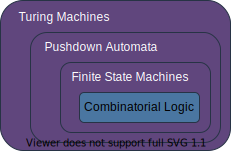

# Combinatorial Logic

This serves as an introduction to Boolean logic with the goal of laying down a foundation for the theory of computation.

[toc]

## [Defining Computation](#top)

What are computers? When most people think of computers, they envision binary, a series of ones and zeros. A _computer_ is a device which can shuffle around ones and zeros according to some predefined rules; the rules which govern the computer's actions is called an _algorithm_. But what does it actually mean to _compute_ something? A computer takes a sequence of binary digits as input and using an algorithm, it produces an output. 

Any binary value is also called a Boolean, these are all examples.
$$
\begin{array}{c|c}
\text{true} & \text{false}\\
1 & 0 \\
\text{accept} & \text{reject}
\end{array}
$$

This document discusses the rules which govern how these binary digits interact with each other.

## [Boolean Functions](#top)

In algebra, a function takes in a number and uses some predefined rules to produce an output. For example a line: $f(x)=mx+b.$

Formally, we would say the function transforms a real number into another real number $f:\mathbb{R}\to\mathbb{R}.$ In this equation, $x$ is a variable which represents some real number. We can have functions which take in multiple variables and produce a single real number: $f(x_1,x_2,\dots,x_n):\mathbb{R}^n\to\mathbb{R}.$

In combinatorial logic, we define Boolean functions which take in Boolean variables and produces a single Boolean. Since a Boolean can be either $0$ or $1$, we use the notation $f(x_1,x_2,\dots,x_n):\{0,1\}^n\to\{0,1\}.$ Where all of the $x$ variables are Booleans instead of real numbers in this function.

Real numbered functions can use a graph to define the outputs for all of the inputs, but we use tables for Boolean functions. A table defines the output of the Boolean function for every possible input. Here is an example of a truth table:
$$
\begin{array}{c|c|c}
x_0 & x_1 & f(x_0,x_1) \\
\hline
0 & 0 & 0 \\
\hline
0 & 1 & 0 \\
\hline
1 & 0 & 0 \\
\hline
1 & 1 & 1
\end{array}
$$
In the above example, the function $f(x_0,x_1):\{0,1\}^2\to\{0,1\}$ returns true when both of the inputs are true. 

## [Boolean Operations](#top)

Algebraic functions can be shown using a graph, but they can also be described symbolically using the operations $+,-,\cross,\div$ and more. Similarly, we can also describe Boolean functions using operations. Boolean operations are also called _gates_. 

### [NOT Gate](#top)

The NOT logic gate takes in a single variable as input. It produces $\text{true}$ when the input is $\text{false}$, and the result is $\text{false}$ when the input is $\text{true}$. The symbol used for this operation is $\neg.$
$$
\begin{array}{c|c}
x_0 & \neg x_0 \\
\hline
0 & 1 \\
\hline
1 & 0
\end{array}
$$

### [AND Gate](#top)

The AND logic gate takes in two variables as inputs. It produces $\text{true}$ when both of the inputs are $\text{true}$, and the result is $\text{false}$ for every other input combination. The symbol used for this operation is $\and.$
$$
\begin{array}{c|c|c}
x_0 & x_1 & x_0\and x_1 \\
\hline
0 & 0 & 0 \\
\hline
0 & 1 & 0 \\
\hline
1 & 0 & 0 \\
\hline
1 & 1 & 1
\end{array}
$$

### [OR Gate](#top)

The OR logic gate takes in two variables as inputs. It produces $\text{true}$ when one or more of the inputs are $\text{true}$, and the result is $\text{false}$ when both of the inputs are $\text{false}$. The symbol for this operation is $\or.$
$$
\begin{array}{c|c|c}
x_0 & x_1 & x_0\or x_1 \\
\hline
0 & 0 & 0 \\
\hline
0 & 1 & 1 \\
\hline
1 & 0 & 1 \\
\hline
1 & 1 & 1
\end{array}
$$

### [XOR Gate](#top)

The XOR logic gate takes in two variables as inputs. It produces $\text{true}$ when exactly one of the inputs is $\text{true}$, and the result is $\text{false}$ when both of the inputs are the same. The symbol for the exclusive OR operation is $\oplus.$
$$
\begin{array}{c|c|c}
x_0 & x_1 & x_0\oplus x_1 \\
\hline
0 & 0 & 0 \\
\hline
0 & 1 & 1 \\
\hline
1 & 0 & 1 \\
\hline
1 & 1 & 0
\end{array}
$$
The exclusive OR is used when one or the other is $\text{true}$, but not both. Linguistically, we don't distinguish between the inclusive and exclusive OR when speaking English. At most restaurants, when the waiter asks "soup or salad?" getting both isn't an option. However, if someone were to ask you "do you speak Spanish or Italian?" answering "both!" is perfectly reasonable. Since English uses the word 'or' to represent the inclusive and exclusive OR, distinguishing them comes from context. In Boolean logic, there is never ambiguity because we use OR and XOR to represent the different cases.

Also, every gate can be written using other gates. For example, the XOR gate can be written as $x_0\oplus x_1=(x_0\and\neg x_1)\or(\neg x_0\and x_1).$

The fact that gates can be written using other gates brings us to a pretty interesting question: what are the fundamental gates? Are there any gates which can't be broken down any further? The answer is that fundamental gates don't exist because _every_ gate can be written using other gates. 

For example take the NOT gate. How could we express the NOT gate using one of the other gates discussed? It doesn't make sense to say we can build a single input gate out of multi-input gates, but what if we fix one of the inputs to a constant value? Using this idea, the not gate can be constructed out of the XOR gate $\neg x_0=x_0\oplus 1$. Here, we force $x_1$ to be $1$ regardless of $x_0$. The $1$ is called a _literal_. 

This idea extends to all Boolean gates. Therefore, a fundamental gate $G$ cannot exist because it would imply that Boolean gates could be written using $G,$ but there is no combination of other Boolean gates which would produce $G.$

### [NAND & NOR Gates](#top)

We know every gate can be written using other gates, but now we'd like to ask a slightly different question. Which gates are _universal_? A set of gates are considered universal if they are sufficient to implement every other gate. 

For example, the NOT gate is not universal by itself. This is because it is impossible to implement the AND gate by exclusively using NOT gates. 

It seems reasonable that you can't make a multi-input gate out of single input gates, but it is also impossible to construct the NOT gate out of AND gates. Therefore the AND gate is also not universal by itself.

So, is there a gate which can implement every gate by itself? Yes! They are called NAND and NOR. The NAND gate performs an AND, then inverts the output. We use the symbol $\overline{\cdot}$ to represent NAND. Similarly, the NOR gate performs an OR, then inverts the output. We use the symbol $\overline{+}$ to represent NOR.
$$
\begin{array}{c|c|c}
x_0 & x_1 & x_0\overline{\cdot} x_1 \\
\hline
0 & 0 & 1 \\
\hline
0 & 1 & 1 \\
\hline
1 & 0 & 1 \\
\hline
1 & 1 & 0
\end{array}
\qquad
\begin{array}{c|c|c}
x_0 & x_1 & x_0\overline{+} x_1 \\
\hline
0 & 0 & 1 \\
\hline
0 & 1 & 0 \\
\hline
1 & 0 & 0 \\
\hline
1 & 1 & 0
\end{array}
$$

We can construct the gates seen so far out of NAND gates:
$$
\begin{align*}
\neg x_0 &= x_0\overline\cdot x_0 \\
x_0\and x_1 &= (x_0\overline\cdot x_1)\overline\cdot(x_0\overline\cdot x_1) \\
x_0\or x_1 &= (x_0\overline\cdot x_0)\overline\cdot(x_1\overline\cdot x_1) \\
x_0\oplus x_1 &= (x_0\overline\cdot x_0 \overline\cdot x_1)\overline\cdot(x_1\overline\cdot x_0 \overline\cdot x_1)
\end{align*}
$$
Calling NAND and NOR universal is the same thing as calling them _functionally complete_ because it is possible to implement every boolean function $f:\{0,1\}^n\to \{0,1\}$ out of just NAND gates or just NOR gates.

## [Conclusion](#top)

